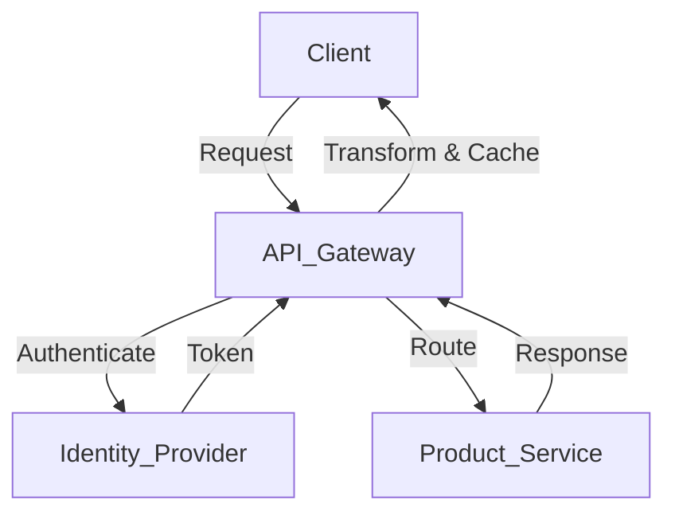

```markdown
# Comprehensive API Gateway Guide

This in-depth guide breaks down the essential concepts of **API Gateways**, providing a structured approach from foundational understanding to advanced mastery. Utilizing the **ShopEase Example**, an e-commerce platform evolving its API, we will explore various components and workflows involved in API Gateways. Each section includes detailed explanations, practical examples, code snippets, best practices, and comparative analyses to facilitate a thorough comprehension of API Gateway functionalities.

---
## Table of Contents

1. [Introduction to API Gateways](#1-introduction-to-api-gateways)
2. [ShopEase API Gateway Evolution](#2-shopease-api-gateway-evolution)
3. [Core Components of an API Gateway](#3-core-components-of-an-api-gateway)
    - [3.1 Routing](#31-routing)
    - [3.2 Authentication and Authorization](#32-authentication-and-authorization)
    - [3.3 Rate Limiting and Throttling](#33-rate-limiting-and-throttling)
    - [3.4 Caching](#34-caching)
    - [3.5 Load Balancing](#35-load-balancing)
    - [3.6 Logging and Monitoring](#36-logging-and-monitoring)
    - [3.7 Transformation and Aggregation](#37-transformation-and-aggregation)
4. [Workflows Involved in API Gateways](#4-workflows-involved-in-api-gateways)
    - [4.1 Client Request Flow](#41-client-request-flow)
    - [4.2 Error Handling](#42-error-handling)
    - [4.3 Versioning and Deployment](#43-versioning-and-deployment)
5. [Advanced Topics](#5-advanced-topics)
    - [5.1 Integration with Microservices](#51-integration-with-microservices)
    - [5.2 Event-Driven Architectures](#52-event-driven-architectures)
    - [5.3 Security Enhancements](#53-security-enhancements)
    - [5.4 Serverless Integrations](#54-serverless-integrations)
6. [Best Practices for API Gateway Implementation](#6-best-practices-for-api-gateway-implementation)
7. [Comparative Analysis of API Gateway Solutions](#7-comparative-analysis-of-api-gateway-solutions)
8. [Conclusion](#8-conclusion)

[**Go to Top**](#comprehensive-api-gateway-guide)

---

## 1. Introduction to API Gateways

### **Concept:**

An **API Gateway** serves as a centralized entry point for all client interactions with backend services. It abstracts the complexity of the underlying microservices architecture, providing a unified interface for clients to access various APIs. By managing tasks such as request routing, authentication, rate limiting, and more, API Gateways enhance security, scalability, and maintainability of distributed systems.

### **Key Functions:**

- **Routing:** Directs incoming requests to the appropriate backend service.
- **Security:** Implements authentication, authorization, and protects against common threats.
- **Performance Optimization:** Utilizes caching, load balancing, and request throttling to enhance performance.
- **Monitoring and Logging:** Tracks API usage, performance metrics, and logs for auditing and troubleshooting.
- **Transformation:** Modifies request and response data formats to suit client needs.

### **Benefits:**

- **Simplified Client Interaction:** Clients interact with a single endpoint, reducing complexity.
- **Enhanced Security:** Centralizes security measures, ensuring consistent protection across services.
- **Scalability:** Efficiently manages traffic distribution and resource allocation.
- **Maintainability:** Facilitates easier updates and modifications to backend services without impacting clients.

### **Real-World Use Case:**

Imagine ShopEase's mobile application requiring data from multiple microservices, such as user profiles, product catalogs, and order processing. Instead of the app making individual API calls to each service, it communicates with the API Gateway. The gateway routes these requests to the respective services, aggregates responses if necessary, and sends a unified response back to the client. This setup simplifies client-side logic and centralizes control over API interactions.

[**Go to Top**](#comprehensive-api-gateway-guide)

---

## 2. ShopEase API Gateway Evolution

### **Initial Situation:**

ShopEase launches with a basic API infrastructure where clients interact directly with individual microservices. For instance:

- **Product Service Endpoint:**
  ```
  https://api.shopease.com/products
  ```
  
- **User Service Endpoint:**
  ```
  https://api.shopease.com/users
  ```

### **The Problem:**

As ShopEase's ecosystem grows, several challenges emerge:

- **Increased Complexity:** Clients need to manage multiple endpoints for different services.
- **Security Risks:** Implementing consistent authentication and authorization across services becomes cumbersome.
- **Performance Bottlenecks:** Direct client-service interactions can lead to inefficient resource utilization and increased latency.
- **Monitoring Difficulties:** Tracking and analyzing API usage across multiple services is fragmented and inefficient.

### **Solution: Implementing an API Gateway**

To address these challenges, ShopEase integrates an API Gateway, centralizing API management and enhancing overall system efficiency and security.

### **API Gateway Integration Steps:**

1. **Deploy API Gateway:** Introduce an API Gateway layer in front of existing microservices.
2. **Configure Routing Rules:** Define rules to route incoming requests to the appropriate backend services.
3. **Implement Security Measures:** Set up authentication and authorization protocols within the gateway.
4. **Enable Caching and Rate Limiting:** Optimize performance and protect backend services from excessive traffic.
5. **Set Up Monitoring and Logging:** Integrate with monitoring tools to track API performance and usage.

### **Outcome:**

With the API Gateway in place, ShopEase achieves:

- **Simplified Client Interactions:** Clients interact with a single endpoint, streamlining API usage.
- **Enhanced Security:** Centralized authentication and authorization ensure consistent security across all services.
- **Improved Performance:** Caching and load balancing optimize response times and resource utilization.
- **Unified Monitoring:** Consolidated logging and monitoring facilitate easier tracking and troubleshooting.

[**Go to Top**](#comprehensive-api-gateway-guide)

---

## 3. Core Components of an API Gateway

Understanding the fundamental components of an API Gateway is essential for effective implementation and management. Below, we explore each core component with detailed explanations and ShopEase-specific examples.

### 3.1 Routing

#### **Concept:**

**Routing** is the mechanism by which the API Gateway directs incoming client requests to the appropriate backend services based on predefined rules. It ensures that each request reaches the correct service, maintaining seamless communication within the microservices architecture.

#### **Implementation with ShopEase:**

- **Example Routing Rules:**
  - Requests to `/products` are routed to the Product Service.
  - Requests to `/users` are routed to the User Service.
  - Requests to `/orders` are routed to the Order Service.

- **Example Configuration:**
  ```yaml
  routes:
    - path: /products
      service: product-service
      methods: [GET, POST]
    - path: /users
      service: user-service
      methods: [GET, POST, DELETE]
    - path: /orders
      service: order-service
      methods: [GET, POST, PUT]
  ```

#### **Pros:**

- **Efficiency:** Directs traffic accurately, reducing unnecessary load on services.
- **Scalability:** Facilitates scaling specific services independently based on demand.
- **Flexibility:** Allows for dynamic routing adjustments as services evolve.

#### **Cons:**

- **Complexity:** Managing a large number of routing rules can become intricate.
- **Latency:** Additional routing steps may introduce slight delays in request processing.

#### **Best Practices:**

- **Use Consistent Path Patterns:** Maintain uniform URL structures to simplify routing configurations.
- **Implement Wildcard Routing:** Utilize patterns or wildcards to handle multiple routes with similar paths efficiently.
- **Monitor Routing Performance:** Regularly assess routing latency and optimize rules to minimize delays.

#### **ShopEase Example Evolution:**

- **v1 Routing:**
  ```yaml
  routes:
    - path: /v1/products
      service: product-service-v1
    - path: /v1/users
      service: user-service-v1
  ```

- **v2 Routing (Introducing new services and updated paths):**
  ```yaml
  routes:
    - path: /v2/products
      service: product-service-v2
    - path: /v2/users
      service: user-service-v2
    - path: /v2/orders
      service: order-service-v2
  ```

[**Go to Top**](#comprehensive-api-gateway-guide)

---

### 3.2 Authentication and Authorization

#### **Concept:**

**Authentication** verifies the identity of clients accessing the API, while **Authorization** determines their permissions and access levels. Implementing robust authentication and authorization mechanisms within the API Gateway ensures that only legitimate and authorized clients can interact with backend services.

#### **Implementation with ShopEase:**

- **Authentication Flow:**
  1. **Client Login:** Users authenticate via an identity provider (e.g., AWS Cognito).
  2. **Token Issuance:** Upon successful authentication, an access token (e.g., JWT) is issued.
  3. **Token Validation:** The API Gateway validates the token for each incoming request.
  
- **Authorization Policies:**
  - Define roles and permissions (e.g., Admin, User) to control access to specific endpoints.
  - Implement scope-based access to restrict actions based on token claims.

- **Example Configuration:**
  ```yaml
  security:
    - name: OAuth2
      type: oauth2
      flows:
        authorizationCode:
          authorizationUrl: https://auth.shopease.com/oauth/authorize
          tokenUrl: https://auth.shopease.com/oauth/token
          scopes:
            read: Grants read access
            write: Grants write access
  ```

#### **Pros:**

- **Enhanced Security:** Centralizes security management, ensuring consistent policies across all services.
- **Scalability:** Efficiently handles authentication and authorization without overloading backend services.
- **Flexibility:** Supports various authentication protocols (e.g., OAuth 2.0, OpenID Connect) and custom authorization rules.

#### **Cons:**

- **Complexity:** Setting up and maintaining authentication and authorization mechanisms can be intricate.
- **Performance Overhead:** Token validation processes may introduce additional processing time.

#### **Best Practices:**

- **Use Standard Protocols:** Implement widely adopted authentication standards like OAuth 2.0 and OpenID Connect for compatibility and security.
- **Token Security:** Ensure tokens are securely stored and transmitted, using HTTPS and secure storage mechanisms.
- **Role-Based Access Control (RBAC):** Define clear roles and permissions to manage user access effectively.
- **Regular Audits:** Continuously monitor and audit authentication and authorization processes to detect and mitigate vulnerabilities.

#### **ShopEase Example Enhancement:**

- **Implementing JWT Validation:**
  ```javascript
  // Example Lambda function for JWT validation (Node.js)
  const jwt = require('jsonwebtoken');
  const jwksClient = require('jwks-rsa');

  const client = jwksClient({
    jwksUri: 'https://auth.shopease.com/.well-known/jwks.json'
  });

  function getKey(header, callback) {
    client.getSigningKey(header.kid, function(err, key) {
      const signingKey = key.publicKey || key.rsaPublicKey;
      callback(null, signingKey);
    });
  }

  exports.handler = function(event, context, callback) {
    const token = event.headers.Authorization.split(' ')[1];

    jwt.verify(token, getKey, {}, function(err, decoded) {
      if (err) {
        return callback(null, {
          statusCode: 401,
          body: JSON.stringify({ error: 'Unauthorized' })
        });
      }
      // Proceed with authorized request
      callback(null, {
        statusCode: 200,
        body: JSON.stringify({ message: 'Authorized', user: decoded })
      });
    });
  };
  ```

[**Go to Top**](#comprehensive-api-gateway-guide)

---

### 3.3 Rate Limiting and Throttling

#### **Concept:**

**Rate Limiting** controls the number of requests a client can make within a specific time frame, preventing abuse and ensuring fair usage. **Throttling** manages traffic flow to maintain optimal performance and protect backend services from being overwhelmed by excessive requests.

#### **Implementation with ShopEase:**

- **Rate Limiting Policies:**
  - **Per-User Limits:** Restrict each user to a certain number of requests per minute/hour.
  - **Per-API Key Limits:** Set different limits based on API key tiers (e.g., free vs. premium).
  
- **Throttling Configuration:**
  - **Burst Rate:** Allow temporary spikes in traffic to accommodate short bursts of requests.
  - **Sustained Rate:** Define the average rate of requests allowed over time.
  
- **Example Configuration:**
  ```yaml
  throttling:
    rateLimit: 1000  # requests per minute
    burstLimit: 200   # maximum burst size
  ```

#### **Pros:**

- **Protection Against Abuse:** Prevents malicious clients from overloading the system with excessive requests.
- **Fair Usage:** Ensures equitable access to API resources among all clients.
- **Improved Performance:** Maintains API responsiveness by controlling traffic flow.

#### **Cons:**

- **Client Frustration:** Legitimate clients might experience request denials if they exceed limits.
- **Complex Configuration:** Determining appropriate limits requires careful analysis of usage patterns.

#### **Best Practices:**

- **Define Clear Limits:** Establish rate and burst limits based on typical and peak usage scenarios.
- **Provide Feedback:** Inform clients when they approach or exceed rate limits through appropriate HTTP status codes (e.g., 429 Too Many Requests).
- **Implement Graceful Degradation:** Allow clients to retry after a specified time or provide alternative responses when limits are reached.
- **Monitor and Adjust:** Continuously track API usage and adjust rate limits as necessary to accommodate changing demand.

#### **ShopEase Example Configuration:**

- **Setting Up Rate Limiting in AWS API Gateway:**
  ```bash
  # Creating a usage plan with rate and burst limits
  aws apigateway create-usage-plan --name "BasicPlan" \
      --throttle burstLimit=200,rateLimit=1000 \
      --quota limit=10000,period=DAY \
      --api-stages apiId=<api-id>,stage=<stage-name>
  
  # Associating an API key with the usage plan
  aws apigateway create-usage-plan-key --usage-plan-id <usage-plan-id> \
      --key-id <api-key-id> --key-type API_KEY
  ```

[**Go to Top**](#comprehensive-api-gateway-guide)

---

### 3.4 Caching

#### **Concept:**

**Caching** involves storing responses from backend services temporarily to reduce latency, minimize backend load, and enhance overall API performance. By serving cached data for repeated requests, API Gateways can significantly improve response times and reduce operational costs.

#### **Implementation with ShopEase:**

- **Cache Configuration:**
  - **Time-to-Live (TTL):** Define how long data remains in the cache before expiring.
  - **Cache Keys:** Determine which request attributes (e.g., URL, headers) are used to uniquely identify cache entries.
  
- **Example Configuration:**
  ```yaml
  caching:
    enabled: true
    ttl: 300  # seconds
    cacheKeys:
      - method
      - path
      - queryParameters
  ```

- **Caching Policies:**
  - **Per-Stage Caching:** Enable caching for specific API stages (e.g., production) while disabling it for others (e.g., development).
  - **Granular Caching Rules:** Customize caching behavior based on request parameters, headers, or resource paths.

#### **Pros:**

- **Enhanced Performance:** Delivers faster responses by serving data from the cache instead of processing backend requests.
- **Reduced Backend Load:** Lowers the number of requests hitting backend services, improving their scalability and reliability.
- **Cost Efficiency:** Decreases operational costs by minimizing resource utilization for repeated requests.

#### **Cons:**

- **Stale Data:** Cached data might become outdated, leading to clients receiving outdated information.
- **Cache Invalidation Complexity:** Managing when and how to invalidate cached data can be challenging.
- **Limited Cache Size:** Depending on the caching mechanism, storage limitations might restrict the amount of data that can be cached.

#### **Best Practices:**

- **Set Appropriate TTLs:** Balance between data freshness and cache hit rates by setting suitable TTL values based on data volatility.
- **Implement Cache Invalidation Strategies:** Use methods like manual eviction, event-driven invalidation, or TTL expiration to keep cached data up-to-date.
- **Optimize Cache Keys:** Design cache keys to include relevant request attributes, ensuring that cached responses are accurately matched to client requests.
- **Monitor Cache Performance:** Track cache hit/miss ratios and adjust caching policies to maximize effectiveness.

#### **ShopEase Example Enhancement:**

- **Enabling Caching for Product Catalog:**
  ```bash
  # Enabling caching for the /products endpoint in AWS API Gateway
  aws apigateway update-method --rest-api-id <api-id> --resource-id <resource-id> \
      --http-method GET --patch-operations op=replace,path=/methodIntegration/caching/enabled,value=true
  
  # Setting cache TTL to 300 seconds for the production stage
  aws apigateway update-stage --rest-api-id <api-id> --stage-name prod \
      --patch-operations op=replace,path=/cacheClusterEnabled,value=true \
      op=replace,path=/cacheClusterSize,value=0.5 \
      op=replace,path=/cacheTtlInSeconds,value=300
  ```

[**Go to Top**](#comprehensive-api-gateway-guide)

---

### 3.5 Load Balancing

#### **Concept:**

**Load Balancing** distributes incoming API requests across multiple backend servers or instances to ensure optimal resource utilization, maximize throughput, and prevent any single server from becoming a bottleneck. It enhances the reliability and scalability of API services by balancing the traffic load efficiently.

#### **Implementation with ShopEase:**

- **Load Balancing Strategies:**
  - **Round Robin:** Distributes requests sequentially across available servers.
  - **Least Connections:** Directs traffic to the server with the fewest active connections.
  - **IP Hash:** Routes requests based on the client's IP address, ensuring consistent routing for repeat clients.
  
- **Example Configuration:**
  ```yaml
  loadBalancing:
    strategy: least-connections
    servers:
      - server1.shopease.com
      - server2.shopease.com
      - server3.shopease.com
  ```

#### **Pros:**

- **Improved Reliability:** Distributes load to prevent any single server from being overwhelmed, enhancing system uptime.
- **Scalability:** Facilitates horizontal scaling by adding more servers to handle increased traffic.
- **Enhanced Performance:** Optimizes resource utilization, ensuring that servers operate efficiently.

#### **Cons:**

- **Complex Configuration:** Setting up and managing load balancing rules can be intricate, especially in dynamic environments.
- **Potential Latency:** Additional routing steps may introduce minimal delays in request processing.
- **Dependency on Load Balancer:** The load balancer itself becomes a critical component that must be highly available.

#### **Best Practices:**

- **Health Checks:** Regularly monitor the health of backend servers to ensure that traffic is only routed to healthy instances.
- **Session Persistence:** Implement session affinity if required, ensuring that clients consistently interact with the same backend server.
- **Auto-Scaling Integration:** Integrate load balancing with auto-scaling mechanisms to dynamically adjust the number of backend servers based on traffic demand.
- **Secure Load Balancing:** Ensure that load balancers handle SSL/TLS termination securely, protecting data in transit.

#### **ShopEase Example Enhancement:**

- **Implementing Round Robin Load Balancing:**
  ```yaml
  loadBalancing:
    strategy: round-robin
    servers:
      - product-service1.shopease.com
      - product-service2.shopease.com
      - product-service3.shopease.com
  ```

- **Configuring Health Checks in AWS Elastic Load Balancer (ELB):**
  ```bash
  # Creating a target group with health checks
  aws elbv2 create-target-group --name product-targets --protocol HTTP --port 80 \
      --vpc-id <vpc-id> --health-check-protocol HTTP --health-check-port 80 \
      --health-check-path /health --health-check-interval-seconds 30 \
      --health-check-timeout-seconds 5 --healthy-threshold-count 3 \
      --unhealthy-threshold-count 2
  ```

[**Go to Top**](#comprehensive-api-gateway-guide)

---

### 3.6 Logging and Monitoring

#### **Concept:**

**Logging** and **Monitoring** are essential for maintaining the health, performance, and security of APIs. **Logging** captures detailed records of API requests and responses, while **Monitoring** tracks real-time metrics and trends to ensure optimal API functionality and facilitate proactive issue resolution.

#### **Implementation with ShopEase:**

- **Logging Components:**
  - **Request Logs:** Capture details of each API request, including timestamps, endpoints, parameters, and client information.
  - **Response Logs:** Record responses sent to clients, including status codes and response times.
  - **Error Logs:** Document errors and exceptions for troubleshooting and analysis.
  
- **Monitoring Components:**
  - **Performance Metrics:** Track metrics such as latency, throughput, error rates, and resource utilization.
  - **Alerting Systems:** Set up alerts for abnormal metrics (e.g., spike in error rates) to enable prompt responses.
  - **Dashboards:** Visualize API performance and usage trends using tools like Grafana, Kibana, or AWS CloudWatch.
  
- **Example Configuration:**
  ```yaml
  logging:
    enabled: true
    logLevel: INFO
    destinations:
      - type: cloudwatch
        logGroup: /api/shopease/logs
  monitoring:
    metrics:
      - latency
      - requestCount
      - errorRate
    alerting:
      - metric: errorRate
        threshold: 5%
        action: notify-admin
    dashboards:
      - name: API Performance
        widgets:
          - type: graph
            metric: latency
          - type: graph
            metric: requestCount
  ```

#### **Pros:**

- **Enhanced Visibility:** Provides comprehensive insights into API usage, performance, and potential issues.
- **Proactive Issue Detection:** Enables the identification and resolution of problems before they impact clients.
- **Facilitates Auditing:** Maintains records for compliance and security audits.

#### **Cons:**

- **Storage Overhead:** Extensive logging can consume significant storage resources.
- **Performance Impact:** Excessive logging may introduce latency and affect API performance.
- **Data Privacy Concerns:** Logs may contain sensitive information, necessitating strict access controls and data protection measures.

#### **Best Practices:**

- **Log Management:** Implement log rotation and retention policies to manage storage efficiently.
- **Anonymize Sensitive Data:** Ensure that logs do not contain personally identifiable information (PII) or other sensitive data.
- **Use Structured Logging:** Adopt structured log formats (e.g., JSON) to facilitate easier parsing and analysis.
- **Integrate with Monitoring Tools:** Leverage centralized monitoring solutions to aggregate and visualize logs and metrics effectively.
- **Set Appropriate Log Levels:** Balance between comprehensive logging and performance by setting suitable log levels (e.g., DEBUG, INFO, WARN, ERROR).

#### **ShopEase Example Enhancement:**

- **Configuring AWS CloudWatch for API Gateway Monitoring:**
  ```bash
  # Enabling detailed CloudWatch metrics for API Gateway
  aws apigateway update-stage --rest-api-id <api-id> --stage-name prod \
      --patch-operations op=replace,path=/methodSettings/*/*/metricsEnabled,value=true \
      op=replace,path=/methodSettings/*/*/loggingLevel,value=INFO
  
  # Creating a CloudWatch Dashboard for API Performance
  aws cloudwatch put-dashboard --dashboard-name "ShopEaseAPIDashboard" --dashboard-body file://dashboard.json
  ```

- **Sample CloudWatch Dashboard Configuration (`dashboard.json`):**
  ```json
  {
    "widgets": [
      {
        "type": "metric",
        "x": 0,
        "y": 0,
        "width": 24,
        "height": 6,
        "properties": {
          "metrics": [
            [ "AWS/ApiGateway", "Latency", "ApiName", "ShopEaseAPI" ],
            [ ".", "4XXError", ".", "." ],
            [ ".", "5XXError", ".", "." ]
          ],
          "period": 300,
          "stat": "Average",
          "region": "us-east-1",
          "title": "API Gateway Latency and Errors"
        }
      }
    ]
  }
  ```

[**Go to Top**](#comprehensive-api-gateway-guide)

---

### 3.7 Transformation and Aggregation

#### **Concept:**

**Transformation** and **Aggregation** involve modifying and combining data as it passes through the API Gateway. **Transformation** alters the format or structure of requests and responses, ensuring compatibility between clients and backend services. **Aggregation** consolidates responses from multiple services into a single, coherent response for the client.

#### **Implementation with ShopEase:**

- **Data Transformation:**
  - **Request Transformation:** Modify incoming client requests to match backend service expectations (e.g., changing field names, adjusting data formats).
  - **Response Transformation:** Alter backend responses to suit client requirements (e.g., renaming fields, filtering data).
  
- **Response Aggregation:**
  - Combine data from multiple backend services into a unified response. For example, aggregating product details and inventory status into a single response.

- **Example Configuration:**
  ```yaml
  transformation:
    request:
      templates:
        - match: /products
          transform:
            rename:
              name: title
    response:
      templates:
        - match: /products
          transform:
            filter:
              - id
              - title
              - price
  aggregation:
    endpoints:
      - /products
      - /inventory
    combine:
      method: merge
      fields:
        - productId: id
        - stock: inventory.stock
  ```

#### **Pros:**

- **Enhanced Flexibility:** Allows clients and backend services to evolve independently by handling data discrepancies at the gateway level.
- **Reduced Client Complexity:** Clients receive data in the desired format without needing to perform additional transformations.
- **Optimized Responses:** Aggregating data can minimize the number of client-side requests, improving efficiency.

#### **Cons:**

- **Increased Processing Load:** Additional transformations and aggregations can introduce processing overhead, potentially affecting performance.
- **Complex Configuration:** Managing complex transformation rules and aggregation logic can be challenging.
- **Potential for Data Inconsistency:** Improper transformations may lead to mismatched or inconsistent data being sent to clients.

#### **Best Practices:**

- **Keep Transformations Simple:** Avoid overly complex transformation logic to maintain performance and reduce errors.
- **Use Templates and Scripts:** Leverage templating languages (e.g., Velocity Template Language) or scripts for efficient and maintainable transformations.
- **Validate Transformed Data:** Ensure that transformed responses adhere to expected schemas and formats to prevent client-side issues.
- **Document Transformation Rules:** Maintain clear documentation of all transformation and aggregation rules for transparency and ease of maintenance.

#### **ShopEase Example Enhancement:**

- **Implementing Response Transformation Using AWS API Gateway Mapping Templates:**
  ```json
  {
    "id": "$input.json('$.id')",
    "title": "$input.json('$.name')",
    "price": "$input.json('$.price')"
  }
  ```

- **Aggregating Responses from Multiple Services Using AWS Lambda:**
  ```javascript
  // Example Lambda function for response aggregation
  const axios = require('axios');

  exports.handler = async (event) => {
      const productId = event.pathParameters.id;

      // Fetch product details
      const productResponse = await axios.get(`https://api.shopease.com/v2/products/${productId}`);

      // Fetch inventory status
      const inventoryResponse = await axios.get(`https://api.shopease.com/v2/inventory/${productId}`);

      // Aggregate responses
      const aggregatedResponse = {
          id: productResponse.data.id,
          title: productResponse.data.title,
          price: productResponse.data.price,
          stock: inventoryResponse.data.stock
      };

      return {
          statusCode: 200,
          body: JSON.stringify(aggregatedResponse)
      };
  };
  ```

[**Go to Top**](#comprehensive-api-gateway-guide)

---

## 4. Workflows Involved in API Gateways

Understanding the workflows facilitated by an API Gateway is crucial for designing efficient and effective API architectures. Below, we explore key workflows with detailed explanations and ShopEase-specific examples.

### 4.1 Client Request Flow

#### **Concept:**

The **Client Request Flow** outlines the journey of an API request from the client through the API Gateway to the backend services and back. It encompasses all the processing steps the request undergoes, including routing, security checks, transformations, and response handling.

#### **Workflow Steps:**

1. **Client Initiates Request:**
   - The client (e.g., mobile app, web browser) sends an HTTP request to the API Gateway.
   
2. **API Gateway Receives Request:**
   - The gateway acts as the single entry point, receiving all incoming requests.
   
3. **Authentication and Authorization:**
   - The gateway validates the client's identity and permissions using tokens or API keys.
   
4. **Rate Limiting and Throttling:**
   - The gateway checks if the client has exceeded any predefined rate limits or quotas.
   
5. **Routing:**
   - Based on the request path and method, the gateway routes the request to the appropriate backend service.
   
6. **Request Transformation (if applicable):**
   - The gateway modifies the request data to match the backend service's expected format.
   
7. **Backend Service Processing:**
   - The targeted microservice processes the request and generates a response.
   
8. **Response Transformation (if applicable):**
   - The gateway alters the backend response to suit the client's requirements.
   
9. **Caching (if applicable):**
   - The gateway caches the response for future similar requests, enhancing performance.
   
10. **Response Handling:**
    - The gateway sends the final response back to the client.

#### **ShopEase Example:**

- **Scenario:** A client requests product details from ShopEase.
  
- **Flow:**
  1. **Request:** `GET https://api.shopease.com/v2/products/1`
  2. **Authentication:** API Gateway validates the JWT token provided in the `Authorization` header.
  3. **Rate Limiting:** Checks if the client has not exceeded the allowed request rate.
  4. **Routing:** Routes the request to the Product Service (`product-service-v2`).
  5. **Processing:** Product Service retrieves product data from the database.
  6. **Response Transformation:** Renames fields (`name` to `title`) before sending the response.
  7. **Caching:** Caches the transformed response for future requests.
  8. **Response:** API Gateway returns the final JSON response to the client.

#### **Diagram:**



#### **Pros:**

- **Centralized Control:** Simplifies management by handling all requests through a single point.
- **Enhanced Security:** Enforces consistent security policies across all API interactions.
- **Performance Optimization:** Utilizes caching and load balancing to improve response times and reduce backend load.

#### **Cons:**

- **Single Point of Failure:** If the API Gateway experiences issues, all client interactions are affected.
- **Potential Bottleneck:** High traffic volumes may overwhelm the gateway, impacting performance.
- **Increased Complexity:** Adding an additional layer introduces complexity in configuration and maintenance.

#### **Best Practices:**

- **High Availability:** Deploy API Gateways in redundant configurations to prevent downtime.
- **Scalable Infrastructure:** Ensure that the gateway can scale horizontally to handle varying traffic loads.
- **Comprehensive Monitoring:** Continuously monitor gateway performance and health to detect and address issues promptly.
- **Secure Configuration:** Harden gateway security settings to protect against common threats and vulnerabilities.

#### **ShopEase Example Enhancement:**

- **Deploying API Gateway with High Availability:**
  ```bash
  # Deploying multiple instances of API Gateway in different availability zones for redundancy
  aws apigateway create-rest-api --name "ShopEaseAPI" --endpoint-configuration types=REGIONAL
  ```

- **Configuring Auto-Scaling:**
  ```yaml
  autoScaling:
    enabled: true
    minInstances: 2
    maxInstances: 10
    scalingPolicy:
      targetCPUUtilization: 70
  ```

[**Go to Top**](#comprehensive-api-gateway-guide)

---

### 4.2 Error Handling

#### **Concept:**

**Error Handling** within an API Gateway ensures that clients receive meaningful and consistent error responses when issues occur. It involves intercepting errors from backend services, transforming them into standardized formats, and providing actionable information to clients.

#### **Implementation with ShopEase:**

- **Error Interception:**
  - The gateway captures errors returned by backend services, such as 4xx and 5xx HTTP status codes.
  
- **Error Transformation:**
  - Modify backend error responses to include standardized error codes and messages.
  
- **Error Responses:**
  - Send consistent error formats to clients, aiding in easier debugging and resolution.
  
- **Example Configuration:**
  ```yaml
  errorHandling:
    transformErrors: true
    errorResponses:
      - statusCode: 400
        message: "Bad Request: Invalid input parameters."
      - statusCode: 401
        message: "Unauthorized: Authentication failed."
      - statusCode: 500
        message: "Internal Server Error: Please try again later."
  ```

- **Custom Error Pages:**
  - Serve user-friendly error pages or messages for common error scenarios.

#### **Pros:**

- **Consistency:** Provides uniform error responses, enhancing client-side error handling.
- **Security:** Prevents leakage of sensitive backend error details to clients.
- **Improved Client Experience:** Offers clear and actionable error messages, facilitating easier issue resolution.

#### **Cons:**

- **Overhead:** Additional processing is required to intercept and transform errors.
- **Potential Miscommunication:** If not properly configured, clients might receive generic errors that lack necessary context.
- **Maintenance Complexity:** Managing and updating error handling rules can become complex as the API evolves.

#### **Best Practices:**

- **Standardize Error Formats:** Adopt a consistent error response structure across all API versions.
- **Include Helpful Information:** Provide meaningful error codes and descriptive messages without exposing sensitive details.
- **Implement Logging:** Log all errors for auditing and troubleshooting purposes.
- **Handle Specific Errors:** Tailor error responses based on different error types (e.g., validation errors, authentication failures).

#### **ShopEase Example Enhancement:**

- **Implementing Custom Error Responses in AWS API Gateway:**
  ```yaml
  errorHandling:
    statusCodes:
      - statusCode: 400
        selectionPattern: ".*BadRequest.*"
        responseTemplates:
          application/json: |
            {
              "error": "Bad Request",
              "message": "Invalid input parameters."
            }
      - statusCode: 500
        selectionPattern: ".*InternalError.*"
        responseTemplates:
          application/json: |
            {
              "error": "Internal Server Error",
              "message": "An unexpected error occurred. Please try again later."
            }
  ```

- **Configuring Gateway Responses in AWS API Gateway:**
  ```bash
  # Adding a custom response for unauthorized access
  aws apigateway update-gateway-response --rest-api-id <api-id> \
      --response-type UNAUTHORIZED \
      --patch-operations op=replace,path=/responseTemplates/application~1json,value='{"error":"Unauthorized","message":"Authentication failed."}'
  ```

[**Go to Top**](#comprehensive-api-gateway-guide)

---

### 4.3 Versioning and Deployment

#### **Concept:**

**Versioning** in the context of API Gateways refers to managing different iterations of APIs to handle updates, enhancements, and deprecations without disrupting existing clients. **Deployment** involves releasing these API versions into various environments (e.g., development, staging, production) in a controlled and systematic manner.

#### **Implementation with ShopEase:**

- **API Versioning:**
  - Define versioning strategies (e.g., URI versioning, Semantic Versioning) to manage API changes.
  - Maintain multiple API versions concurrently to support legacy clients while introducing new features.

- **Deployment Stages:**
  - **Development Stage (`/dev`):** For internal testing and development purposes.
  - **Staging Stage (`/staging`):** For pre-production testing and quality assurance.
  - **Production Stage (`/prod`):** For live client interactions and serving actual traffic.
  
- **Deployment Strategies:**
  - **Blue-Green Deployment:** Maintain two identical environments (blue and green) and switch traffic between them during updates.
  - **Canary Deployment:** Gradually roll out new API versions to a subset of users before full-scale deployment.
  
- **Example Configuration:**
  ```yaml
  deployment:
    stages:
      - name: dev
        version: v1.0.0
        environment: development
      - name: staging
        version: v1.1.0
        environment: staging
      - name: prod
        version: v2.0.0
        environment: production
    strategies:
      - type: canary
        percentage: 10
        increment: 10
  ```

#### **Pros:**

- **Seamless Updates:** Enables introducing new API versions without disrupting existing clients.
- **Controlled Rollouts:** Allows gradual deployment of changes, reducing the risk of widespread issues.
- **Environment Isolation:** Separates different stages, ensuring that development and testing activities do not impact production.

#### **Cons:**

- **Resource Intensive:** Maintaining multiple API versions and environments requires additional resources and infrastructure.
- **Complex Management:** Coordinating deployments across different stages and versions can introduce complexity.
- **Potential for Configuration Drift:** Ensuring consistency across environments is critical to prevent discrepancies and errors.

#### **Best Practices:**

- **Automate Deployments:** Utilize CI/CD pipelines and Infrastructure-as-Code (IaC) tools to automate versioning and deployment processes.
- **Consistent Environment Configuration:** Ensure that all deployment stages are configured consistently to avoid environment-specific issues.
- **Monitor Deployments:** Continuously monitor the impact of deployments using monitoring and logging tools to detect and address issues promptly.
- **Provide Clear Documentation:** Maintain comprehensive documentation for each API version and deployment stage to facilitate client integration and support.

#### **ShopEase Example Enhancement:**

- **Implementing Canary Deployment in AWS API Gateway:**
  ```bash
  # Creating a new deployment for canary release
  aws apigateway create-deployment --rest-api-id <api-id> --stage-name prod \
      --canary-settings '{"percentTraffic":10,"stageVariableOverrides":{"version":"v2.0.0"},"useStageCache":true}'
  
  # Updating canary settings to increment traffic
  aws apigateway update-stage --rest-api-id <api-id> --stage-name prod \
      --patch-operations op=replace,path=/canarySettings/percentTraffic,value=20
  ```

- **Using AWS CloudFormation for Automated Deployment:**
  ```yaml
  Resources:
    ApiGateway:
      Type: AWS::ApiGateway::RestApi
      Properties:
        Name: ShopEaseAPI
    ProdStage:
      Type: AWS::ApiGateway::Stage
      Properties:
        StageName: prod
        RestApiId: !Ref ApiGateway
        DeploymentId: !Ref ApiDeployment
        CanarySettings:
          PercentTraffic: 10
          StageVariableOverrides:
            version: v2.0.0
          UseStageCache: true
    ApiDeployment:
      Type: AWS::ApiGateway::Deployment
      Properties:
        RestApiId: !Ref ApiGateway
        StageName: prod
  ```

[**Go to Top**](#comprehensive-api-gateway-guide)

---

## 5. Advanced Topics

Delving into advanced aspects of API Gateways enhances their effectiveness and aligns them with modern architectural paradigms. Below, we explore several advanced topics, providing detailed explanations and ShopEase-specific examples.

### 5.1 Integration with Microservices

#### **Concept:**

Integrating API Gateways with **microservices** involves managing the communication between numerous, independently deployable services within a distributed architecture. The API Gateway orchestrates these interactions, ensuring seamless data flow, service discovery, and fault tolerance.

#### **Key Points:**

- **Service Discovery:** Automatically locate and route requests to available microservice instances without hardcoding service endpoints.
- **Circuit Breakers:** Prevent cascading failures by stopping requests to failing services until they recover.
- **Request Aggregation:** Combine responses from multiple microservices into a single, coherent response for the client.

#### **Implementation with ShopEase:**

- **Service Discovery Configuration:**
  ```yaml
  serviceDiscovery:
    enabled: true
    type: consul
    config:
      host: consul.shopease.com
      port: 8500
  ```
  
- **Circuit Breaker Setup Using Hystrix (for resilience):**
  ```yaml
  circuitBreaker:
    enabled: true
    config:
      timeout: 2000
      errorThresholdPercentage: 50
      requestVolumeThreshold: 20
  ```
  
- **Request Aggregation Example:**
  ```javascript
  // Example Lambda function for aggregating product and inventory data
  const axios = require('axios');

  exports.handler = async (event) => {
      const productId = event.pathParameters.id;

      try {
          const [productResponse, inventoryResponse] = await Promise.all([
              axios.get(`https://api.shopease.com/v2/products/${productId}`),
              axios.get(`https://api.shopease.com/v2/inventory/${productId}`)
          ]);

          const aggregatedResponse = {
              id: productResponse.data.id,
              title: productResponse.data.title,
              price: productResponse.data.price,
              stock: inventoryResponse.data.stock
          };

          return {
              statusCode: 200,
              body: JSON.stringify(aggregatedResponse)
          };
      } catch (error) {
          return {
              statusCode: 500,
              body: JSON.stringify({ error: "Failed to retrieve product information." })
          };
      }
  };
  ```

#### **Pros:**

- **Scalability:** Efficiently manages communication across numerous microservices, supporting large-scale architectures.
- **Resilience:** Enhances system reliability through fault-tolerant mechanisms like circuit breakers and retries.
- **Simplified Client Logic:** Clients interact with a unified API Gateway, reducing the complexity of managing multiple service endpoints.

#### **Cons:**

- **Increased Complexity:** Coordinating interactions among multiple services introduces additional layers of complexity.
- **Latency Overhead:** Aggregating responses from multiple services can add to response times.
- **Dependency Management:** Ensuring all microservices are correctly registered and discoverable requires diligent management.

#### **Best Practices:**

- **Automate Service Registration:** Use service discovery tools to automatically register and deregister services, ensuring up-to-date routing information.
- **Implement Resilient Patterns:** Incorporate patterns like retries, timeouts, and circuit breakers to handle service failures gracefully.
- **Optimize Aggregation Logic:** Design efficient aggregation mechanisms to minimize latency and resource consumption.

#### **ShopEase Example Enhancement:**

- **Integrating with Istio Service Mesh for Advanced Microservices Management:**
  ```yaml
  apiVersion: networking.istio.io/v1alpha3
  kind: VirtualService
  metadata:
    name: product-service
  spec:
    hosts:
      - products.api.shopease.com
    http:
      - match:
          - uri:
              prefix: /v2/products
        route:
          - destination:
              host: product-service-v2
              port:
                number: 80
          - destination:
              host: product-service-v1
              port:
                number: 80
              weight: 10
        retries:
          attempts: 3
          perTryTimeout: 2s
          retryOn: gateway-error,connect-failure,refused-stream
  ```

[**Go to Top**](#comprehensive-api-gateway-guide)

---

### 5.2 Monitoring and Logging

#### **Concept:**

**Monitoring** and **Logging** are critical for maintaining the health, performance, and security of APIs. Monitoring provides real-time insights into API performance metrics, while logging captures detailed information about API requests, responses, and errors for troubleshooting and analysis.

#### **Monitoring Components:**

- **Performance Metrics:** Track metrics like request latency, throughput, error rates, and resource utilization.
- **Alerting Systems:** Set up alerts to notify teams of performance degradation, failures, or unusual patterns.
- **Dashboards:** Visualize metrics using tools like Grafana, Kibana, or AWS CloudWatch to gain a comprehensive view of API health.

#### **Logging Components:**

- **Request/Response Logs:** Capture details of each API request and response for auditing and debugging.
- **Error Logs:** Log errors and exceptions to identify and resolve issues promptly.
- **Trace Logs:** Implement distributed tracing to follow requests across multiple microservices and identify bottlenecks.

#### **Implementation with ShopEase:**

- **Integrating AWS CloudWatch for Monitoring:**
  ```bash
  # Enabling detailed CloudWatch metrics for API Gateway
  aws apigateway update-stage --rest-api-id <api-id> --stage-name prod \
      --patch-operations op=replace,path=/methodSettings/*/*/metricsEnabled,value=true \
      op=replace,path=/methodSettings/*/*/loggingLevel,value=INFO
  
  # Creating a CloudWatch Dashboard for API Performance
  aws cloudwatch put-dashboard --dashboard-name "ShopEaseAPIDashboard" --dashboard-body file://dashboard.json
  ```

- **Sample CloudWatch Dashboard Configuration (`dashboard.json`):**
  ```json
  {
    "widgets": [
      {
        "type": "metric",
        "x": 0,
        "y": 0,
        "width": 24,
        "height": 6,
        "properties": {
          "metrics": [
            [ "AWS/ApiGateway", "Latency", "ApiName", "ShopEaseAPI" ],
            [ ".", "4XXError", ".", "." ],
            [ ".", "5XXError", ".", "." ]
          ],
          "period": 300,
          "stat": "Average",
          "region": "us-east-1",
          "title": "API Gateway Latency and Errors"
        }
      }
    ]
  }
  ```

- **Implementing Distributed Tracing with AWS X-Ray:**
  ```bash
  # Enabling X-Ray tracing for API Gateway
  aws apigateway update-stage --rest-api-id <api-id> --stage-name prod \
      --patch-operations op=replace,path=/tracingEnabled,value=true
  ```

#### **Pros:**

- **Enhanced Visibility:** Provides comprehensive insights into API usage, performance, and potential issues.
- **Proactive Issue Detection:** Enables the identification and resolution of problems before they impact clients.
- **Facilitates Auditing:** Maintains records for compliance and security audits.

#### **Cons:**

- **Storage Overhead:** Extensive logging can consume significant storage resources.
- **Performance Impact:** Excessive logging may introduce latency and affect API performance.
- **Data Privacy Concerns:** Logs may contain sensitive information, necessitating strict access controls and data protection measures.

#### **Best Practices:**

- **Implement Log Rotation and Retention:** Manage log storage efficiently by setting appropriate retention policies and rotating logs regularly.
- **Anonymize Sensitive Data:** Ensure that logs do not contain personally identifiable information (PII) or other sensitive data.
- **Use Structured Logging:** Adopt structured log formats (e.g., JSON) to facilitate easier parsing and analysis.
- **Integrate with Monitoring Tools:** Leverage centralized monitoring solutions to aggregate and visualize logs and metrics effectively.
- **Set Appropriate Log Levels:** Balance between comprehensive logging and performance by setting suitable log levels (e.g., DEBUG, INFO, WARN, ERROR).

#### **ShopEase Example Enhancement:**

- **Configuring AWS X-Ray for Distributed Tracing:**
  ```bash
  # Enabling X-Ray tracing for the Product Service Lambda function
  aws lambda update-function-configuration --function-name ProductServiceFunction \
      --tracing-config Mode=Active
  ```

- **Sample X-Ray Trace for a Product Request:**
  ```json
  {
    "traceId": "1-5f47b1e3-2c3b4f5e6a7b8c9d0e1f2a3b",
    "id": "2c3b4f5e6a7b8c9d0e1f2a3b",
    "name": "ShopEaseAPI",
    "startTime": 1600000000.123,
    "endTime": 1600000000.456,
    "http": {
      "request": {
        "method": "GET",
        "url": "https://api.shopease.com/v2/products/1",
        "clientIp": "192.168.1.100"
      },
      "response": {
        "status": 200,
        "contentLength": 256
      }
    },
    "subsegments": [
      {
        "id": "3d4e5f6g7h8i9j0k1l2m3n4o",
        "name": "ProductService",
        "startTime": 1600000000.200,
        "endTime": 1600000000.400,
        "http": {
          "request": {
            "method": "GET",
            "url": "https://product-service.shopease.com/products/1",
            "clientIp": "10.0.0.5"
          },
          "response": {
            "status": 200,
            "contentLength": 256
          }
        }
      }
    ]
  }
  ```

[**Go to Top**](#comprehensive-api-gateway-guide)

---

### 5.3 Throttling and Quotas

#### **Concept:**

**Throttling** and **Quotas** are mechanisms to control the rate and volume of requests that clients can make to an API. These features help prevent abuse, ensure fair usage, and protect backend services from being overwhelmed by excessive traffic.

#### **Throttling:**

- **Rate Limiting:** Restricts the number of requests a client can make within a specified time frame (e.g., 1000 requests per minute).
- **Burst Control:** Allows temporary spikes in traffic by permitting short bursts of requests above the rate limit.
- **Dynamic Throttling:** Adjusts rate limits based on real-time conditions or client behavior.

#### **Quotas:**

- **Usage Limits:** Sets hard limits on the total number of requests a client can make over longer periods (e.g., 10,000 requests per day).
- **Tiered Access:** Defines different quota levels for various client tiers (e.g., free vs. premium clients).
- **Quota Enforcement:** Automatically enforces quota limits, preventing clients from exceeding their allocated usage.

#### **Implementation with ShopEase:**

- **Rate Limiting Policies:**
  ```yaml
  throttling:
    rateLimit: 1000  # requests per minute
    burstLimit: 200   # maximum burst size
  ```
  
- **Quota Policies:**
  ```yaml
  quotas:
    dailyLimit: 10000  # requests per day
    monthlyLimit: 300000  # requests per month
    tiers:
      - name: Free
        dailyLimit: 5000
        monthlyLimit: 150000
      - name: Premium
        dailyLimit: 10000
        monthlyLimit: 300000
  ```

#### **Pros:**

- **Protect Backend Services:** Safeguards against traffic spikes and ensures backend stability.
- **Manage Costs:** Controls operational costs by limiting excessive usage.
- **Enhance Security:** Mitigates denial-of-service (DoS) attacks and other abusive behaviors.

#### **Cons:**

- **Client Frustration:** Legitimate clients might experience request denials if they exceed limits.
- **Complex Configuration:** Determining appropriate limits requires careful analysis of usage patterns.

#### **Best Practices:**

- **Define Appropriate Limits:** Balance between allowing legitimate traffic and preventing abuse by analyzing typical usage patterns.
- **Provide Feedback:** Inform clients when they approach or exceed rate limits through appropriate HTTP status codes (e.g., 429 Too Many Requests).
- **Implement Graceful Degradation:** Allow clients to retry after a specified time or provide alternative responses when limits are reached.
- **Monitor and Adjust:** Continuously track API usage and adjust rate limits as necessary to accommodate changing demand.

#### **ShopEase Example Enhancement:**

- **Configuring Rate Limiting and Quotas in AWS API Gateway:**
  ```bash
  # Creating a usage plan with rate and burst limits
  aws apigateway create-usage-plan --name "BasicPlan" \
      --throttle burstLimit=200,rateLimit=1000 \
      --quota limit=10000,period=DAY \
      --api-stages apiId=<api-id>,stage=<stage-name>
  
  # Associating an API key with the usage plan
  aws apigateway create-usage-plan-key --usage-plan-id <usage-plan-id> \
      --key-id <api-key-id> --key-type API_KEY
  ```

- **Implementing Tiered Quotas:**
  ```yaml
  quotas:
    tiers:
      - name: Free
        description: "Basic access for free tier users."
        limits:
          daily: 5000
          monthly: 150000
      - name: Premium
        description: "Enhanced access for premium tier users."
        limits:
          daily: 10000
          monthly: 300000
  ```

[**Go to Top**](#comprehensive-api-gateway-guide)

---

### 5.4 Security Enhancements

#### **Concept:**

Enhancing the security of API Gateways involves implementing additional layers of protection to safeguard APIs from threats and vulnerabilities. This includes measures like encryption, DDoS protection, and integrating Web Application Firewalls (WAF) to filter and monitor HTTP traffic.

#### **Key Enhancements:**

- **Encryption (HTTPS):** Ensure all data transmitted between clients and the API Gateway is encrypted using SSL/TLS.
- **DDoS Protection:** Implement safeguards to detect and mitigate Distributed Denial-of-Service attacks, preventing service disruptions.
- **Web Application Firewall (WAF):** Protect APIs from common web exploits (e.g., SQL injection, cross-site scripting) by filtering malicious traffic.
- **IP Whitelisting/Blacklisting:** Restrict access to APIs based on client IP addresses, allowing trusted sources while blocking suspicious ones.
- **Content Security Policies:** Define rules to control the types of content that can be accessed or executed by clients.

#### **Implementation with ShopEase:**

- **Enabling SSL/TLS Termination:**
  ```yaml
  ssl:
    enabled: true
    certificateArn: arn:aws:acm:us-east-1:123456789012:certificate/abcd1234-efgh-5678-ijkl-9012mnop3456
  ```
  
- **Configuring AWS WAF:**
  ```yaml
  waf:
    enabled: true
    rules:
      - name: SQLInjectionRule
        priority: 1
        action: block
        statement:
          sqliMatchStatement:
            fieldToMatch:
              uriPath: {}
            textTransformations:
              - priority: 0
                type: NONE
      - name: XSSRule
        priority: 2
        action: block
        statement:
          xssMatchStatement:
            fieldToMatch:
              uriPath: {}
            textTransformations:
              - priority: 0
                type: NONE
  ```

- **Implementing IP Whitelisting:**
  ```yaml
  ipWhitelist:
    enabled: true
    allowedIPs:
      - "192.168.1.100/32"
      - "203.0.113.0/24"
  ```

#### **Pros:**

- **Data Protection:** Secures sensitive information from unauthorized access and breaches.
- **Regulatory Compliance:** Helps meet industry-specific security standards and regulations (e.g., PCI DSS, HIPAA).
- **Enhanced Trust:** Builds client confidence by demonstrating robust security measures.

#### **Cons:**

- **Operational Overhead:** Implementing and maintaining security enhancements can increase complexity.
- **Performance Impact:** Additional security layers may introduce latency and affect API responsiveness.
- **Configuration Complexity:** Properly configuring security measures requires expertise and careful planning.

#### **Best Practices:**

- **Enforce HTTPS:** Ensure that all API interactions occur over secure, encrypted channels.
- **Regularly Update Security Policies:** Keep security rules and configurations up-to-date to protect against emerging threats.
- **Implement Least Privilege:** Grant only the necessary permissions and access levels to clients and services.
- **Conduct Security Audits:** Perform periodic security assessments to identify and remediate vulnerabilities.
- **Monitor Security Metrics:** Continuously track security-related metrics and alerts to detect and respond to threats promptly.

#### **ShopEase Example Enhancement:**

- **Configuring AWS WAF with Custom Rules:**
  ```bash
  # Creating a WAF Web ACL with SQL Injection and XSS protection
  aws wafv2 create-web-acl --name "ShopEaseWAF" --scope REGIONAL \
      --default-action Block={} \
      --rules file://waf-rules.json \
      --visibility-config SampledRequestsEnabled=true,CloudWatchMetricsEnabled=true,MetricName="ShopEaseWAF"
  
  # Sample WAF Rules (`waf-rules.json`)
  [
    {
      "Name": "SQLInjectionRule",
      "Priority": 1,
      "Statement": {
        "SqliMatchStatement": {
          "FieldToMatch": {
            "UriPath": {}
          },
          "TextTransformations": [
            {
              "Priority": 0,
              "Type": "NONE"
            }
          ]
        }
      },
      "Action": {
        "Block": {}
      },
      "VisibilityConfig": {
        "SampledRequestsEnabled": true,
        "CloudWatchMetricsEnabled": true,
        "MetricName": "SQLInjectionRule"
      }
    },
    {
      "Name": "XSSRule",
      "Priority": 2,
      "Statement": {
        "XssMatchStatement": {
          "FieldToMatch": {
            "UriPath": {}
          },
          "TextTransformations": [
            {
              "Priority": 0,
              "Type": "NONE"
            }
          ]
        }
      },
      "Action": {
        "Block": {}
      },
      "VisibilityConfig": {
        "SampledRequestsEnabled": true,
        "CloudWatchMetricsEnabled": true,
        "MetricName": "XSSRule"
      }
    }
  ]
  ```

- **Implementing IP Whitelisting in AWS API Gateway:**
  ```bash
  # Associating WAF Web ACL with API Gateway
  aws wafv2 associate-web-acl --web-acl-arn arn:aws:wafv2:us-east-1:123456789012:webacl/ShopEaseWAF/abcd1234-efgh-5678-ijkl-9012mnop3456 \
      --resource-arn arn:aws:apigateway:us-east-1::/restapis/<api-id>/stages/prod
  ```

[**Go to Top**](#comprehensive-api-gateway-guide)

---

### 5.5 Event-Driven Architectures

#### **Concept:**

**Event-Driven Architectures** leverage asynchronous communication between services, enabling APIs to respond to events in real-time. Integrating API Gateways with event-driven systems (e.g., AWS Lambda) allows for scalable, serverless backends that can handle varying workloads efficiently.

#### **Key Points:**

- **Asynchronous Processing:** Decouple services to handle tasks asynchronously, improving scalability and resilience.
- **Serverless Integration:** Utilize serverless functions to execute code in response to API events without managing servers.
- **Event Streaming:** Implement event streaming platforms (e.g., Kafka, AWS Kinesis) to process and distribute events across services.

#### **Implementation with ShopEase:**

- **Using AWS Lambda for Serverless Backends:**
  ```javascript
  // Example Lambda function for processing orders
  exports.handler = async (event) => {
      const orderData = JSON.parse(event.body);
      
      // Process the order (e.g., validate, store in database)
      const result = await processOrder(orderData);
      
      return {
          statusCode: 200,
          body: JSON.stringify({ message: "Order processed successfully.", orderId: result.orderId })
      };
  };
  ```
  
- **Integrating Lambda with API Gateway:**
  ```bash
  # Creating a Lambda function
  aws lambda create-function --function-name ProcessOrder \
      --runtime nodejs14.x \
      --role arn:aws:iam::123456789012:role/lambda-execution-role \
      --handler index.handler \
      --zip-file fileb://function.zip
  
  # Integrating Lambda with API Gateway via AWS CLI
  aws apigateway put-integration --rest-api-id <api-id> --resource-id <resource-id> \
      --http-method POST --type AWS_PROXY \
      --integration-http-method POST \
      --uri arn:aws:apigateway:<region>:lambda:path/2015-03-31/functions/arn:aws:lambda:<region>:123456789012:function:ProcessOrder/invocations
  ```

- **Implementing Event Streaming with AWS Kinesis:**
  ```bash
  # Creating a Kinesis Stream for order events
  aws kinesis create-stream --stream-name OrderEvents --shard-count 1
  
  # Publishing an event to the Kinesis Stream from Lambda
  const AWS = require('aws-sdk');
  const kinesis = new AWS.Kinesis();

  const params = {
      Data: JSON.stringify(orderData),
      PartitionKey: orderData.orderId.toString(),
      StreamName: 'OrderEvents'
  };

  kinesis.putRecord(params, (err, data) => {
      if (err) console.log(err, err.stack);
      else console.log(data);
  });
  ```

#### **Pros:**

- **Scalability:** Automatically scales with the volume of incoming events, handling spikes efficiently.
- **Cost Efficiency:** Pay only for the compute resources used during event processing, reducing operational costs.
- **Flexibility:** Easily integrate with various services and extend functionalities through event-driven patterns.

#### **Cons:**

- **Complexity:** Designing and managing event-driven systems can be more complex compared to synchronous architectures.
- **Latency:** Asynchronous processing may introduce delays in event handling and response times.
- **Debugging Challenges:** Tracing and debugging issues in distributed, event-driven systems can be more intricate.

#### **Best Practices:**

- **Design for Idempotency:** Ensure that event processing is idempotent to handle duplicate events gracefully.
- **Implement Dead Letter Queues:** Manage failed events by routing them to dead letter queues for later analysis and retry.
- **Monitor Event Streams:** Track event flow and processing to identify bottlenecks and optimize performance.
- **Ensure Event Ordering:** If necessary, maintain the order of events to ensure consistent processing.

#### **ShopEase Example Enhancement:**

- **Setting Up an AWS Lambda Function for Event Processing:**
  ```javascript
  // Example Lambda function to handle order events from Kinesis
  exports.handler = async (event) => {
      for (const record of event.Records) {
          const orderData = Buffer.from(record.kinesis.data, 'base64').toString('utf8');
          console.log("Processing Order:", orderData);
          
          // Process the order (e.g., update inventory, notify shipping)
          await processOrder(JSON.parse(orderData));
      }
      
      return { statusCode: 200, body: "Orders processed successfully." };
  };
  ```
  
- **Configuring Lambda to Trigger from Kinesis Stream:**
  ```bash
  # Adding an event source mapping for Lambda to process Kinesis Stream events
  aws lambda create-event-source-mapping --function-name ProcessOrderEvents \
      --event-source arn:aws:kinesis:<region>:123456789012:stream/OrderEvents \
      --starting-position TRIM_HORIZON \
      --batch-size 100
  ```

[**Go to Top**](#comprehensive-api-gateway-guide)

---

## 6. Best Practices for API Gateway Implementation

Implementing an API Gateway effectively requires adherence to best practices that ensure security, performance, scalability, and maintainability. Below are key best practices tailored for the ShopEase example.

### 6.1 Centralize Security Policies

- **Consistent Authentication and Authorization:** Implement uniform security measures across all API endpoints through the gateway.
- **Use TLS/SSL:** Enforce encryption for all API communications to protect data in transit.
- **Implement WAF Rules:** Utilize Web Application Firewalls to defend against common web exploits.

### 6.2 Optimize Performance

- **Enable Caching:** Reduce latency and backend load by caching frequent responses.
- **Implement Load Balancing:** Distribute traffic evenly across backend services to prevent overload.
- **Minimize Transformation Overhead:** Keep data transformations efficient to maintain low response times.

### 6.3 Ensure High Availability and Scalability

- **Deploy in Multiple Regions:** Distribute API Gateways across different geographic regions to enhance availability and reduce latency.
- **Use Auto-Scaling:** Automatically adjust gateway capacity based on traffic patterns to handle varying loads.
- **Redundant Deployments:** Implement redundant gateway instances to prevent single points of failure.

### 6.4 Maintain Comprehensive Monitoring and Logging

- **Real-Time Monitoring:** Continuously track API performance metrics to identify and resolve issues promptly.
- **Detailed Logging:** Capture comprehensive logs for all API interactions to facilitate troubleshooting and auditing.
- **Set Up Alerts:** Configure alerts for critical metrics (e.g., high error rates, latency spikes) to enable rapid incident response.

### 6.5 Implement Effective Versioning Strategies

- **Adopt Semantic Versioning:** Clearly communicate the nature of changes (breaking vs. non-breaking) through version numbers.
- **Support Multiple Versions:** Allow concurrent support for multiple API versions to accommodate diverse client needs.
- **Deprecate Gracefully:** Provide clear timelines and migration paths for deprecating older API versions.

### 6.6 Facilitate Developer Experience

- **Provide Comprehensive Documentation:** Offer clear and detailed API documentation, including versioning information and usage examples.
- **Implement API Portals:** Create developer portals to streamline API discovery, testing, and integration processes.
- **Support SDKs and Libraries:** Provide Software Development Kits (SDKs) and client libraries to simplify API consumption for developers.

### 6.7 Ensure Robust Security Practices

- **Regular Security Audits:** Conduct periodic security assessments to identify and remediate vulnerabilities.
- **Least Privilege Principle:** Grant only necessary permissions to clients and services to minimize potential attack vectors.
- **Secure Secret Management:** Store API keys, tokens, and certificates securely using environment variables or dedicated secret management services.

### 6.8 Automate Deployment and Management

- **Use Infrastructure-as-Code (IaC):** Implement IaC tools like AWS CloudFormation or Terraform to automate API Gateway configurations and deployments.
- **Continuous Integration/Continuous Deployment (CI/CD):** Integrate API Gateway management into CI/CD pipelines to streamline updates and ensure consistency.
- **Automate Monitoring and Alerts:** Utilize automation for setting up monitoring dashboards and alerting mechanisms to maintain real-time oversight.

### 6.9 Plan for Disaster Recovery

- **Backup Configurations:** Regularly back up API Gateway configurations and related infrastructure settings.
- **Implement Failover Mechanisms:** Design failover strategies to switch to backup gateways in case of primary gateway failures.
- **Test Recovery Procedures:** Conduct regular drills to ensure that disaster recovery plans are effective and can be executed smoothly.

### 6.10 Leverage API Gateway Features Fully

- **Utilize Advanced Features:** Explore and implement advanced API Gateway features like request validation, response transformations, and custom authorizers to enhance API functionality.
- **Stay Updated with Platform Enhancements:** Keep abreast of updates and new features offered by API Gateway platforms to leverage improvements and new capabilities.

#### **ShopEase Example Best Practices Implementation:**

- **Automating API Gateway Deployment with Terraform:**
  ```hcl
  provider "aws" {
    region = "us-east-1"
  }

  resource "aws_api_gateway_rest_api" "shopease_api" {
    name        = "ShopEaseAPI"
    description = "API Gateway for ShopEase E-commerce Platform"
  }

  resource "aws_api_gateway_resource" "products" {
    rest_api_id = aws_api_gateway_rest_api.shopease_api.id
    parent_id   = aws_api_gateway_rest_api.shopease_api.root_resource_id
    path_part   = "products"
  }

  resource "aws_api_gateway_method" "get_products" {
    rest_api_id   = aws_api_gateway_rest_api.shopease_api.id
    resource_id   = aws_api_gateway_resource.products.id
    http_method   = "GET"
    authorization = "NONE"
  }

  resource "aws_api_gateway_integration" "get_products_integration" {
    rest_api_id = aws_api_gateway_rest_api.shopease_api.id
    resource_id = aws_api_gateway_resource.products.id
    http_method = aws_api_gateway_method.get_products.http_method
    type        = "HTTP_PROXY"
    uri         = "https://product-service.shopease.com/products"
  }

  resource "aws_api_gateway_stage" "prod" {
    stage_name    = "prod"
    rest_api_id   = aws_api_gateway_rest_api.shopease_api.id
    deployment_id = aws_api_gateway_deployment.prod.id
    variables = {
      version = "v2.0.0"
    }
  }

  resource "aws_api_gateway_deployment" "prod" {
    depends_on = [aws_api_gateway_integration.get_products_integration]
    rest_api_id = aws_api_gateway_rest_api.shopease_api.id
    stage_name  = "prod"
  }
  ```

[**Go to Top**](#comprehensive-api-gateway-guide)

---

## 6. Best Practices for API Gateway Implementation

Implementing an API Gateway effectively requires adherence to best practices that ensure security, performance, scalability, and maintainability. Below are key best practices tailored for the ShopEase example.

### 6.1 Centralize Security Policies

- **Consistent Authentication and Authorization:** Implement uniform security measures across all API endpoints through the gateway.
- **Use TLS/SSL:** Enforce encryption for all API communications to protect data in transit.
- **Implement WAF Rules:** Utilize Web Application Firewalls to defend against common web exploits.

### 6.2 Optimize Performance

- **Enable Caching:** Reduce latency and backend load by caching frequent responses.
- **Implement Load Balancing:** Distribute traffic evenly across backend services to prevent overload.
- **Minimize Transformation Overhead:** Keep data transformations efficient to maintain low response times.

### 6.3 Ensure High Availability and Scalability

- **Deploy in Multiple Regions:** Distribute API Gateways across different geographic regions to enhance availability and reduce latency.
- **Use Auto-Scaling:** Automatically adjust gateway capacity based on traffic patterns to handle varying loads.
- **Redundant Deployments:** Implement redundant gateway instances to prevent single points of failure.

### 6.4 Maintain Comprehensive Monitoring and Logging

- **Real-Time Monitoring:** Continuously track API performance metrics to identify and resolve issues promptly.
- **Detailed Logging:** Capture comprehensive logs for all API interactions to facilitate troubleshooting and auditing.
- **Set Up Alerts:** Configure alerts for critical metrics (e.g., high error rates, latency spikes) to enable rapid incident response.

### 6.5 Implement Effective Versioning Strategies

- **Adopt Semantic Versioning:** Clearly communicate the nature of changes (breaking vs. non-breaking) through version numbers.
- **Support Multiple Versions:** Allow concurrent support for multiple API versions to accommodate diverse client needs.
- **Deprecate Gracefully:** Provide clear timelines and migration paths for deprecating older API versions.

### 6.6 Facilitate Developer Experience

- **Provide Comprehensive Documentation:** Offer clear and detailed API documentation, including versioning information and usage examples.
- **Implement API Portals:** Create developer portals to streamline API discovery, testing, and integration processes.
- **Support SDKs and Libraries:** Provide Software Development Kits (SDKs) and client libraries to simplify API consumption for developers.

### 6.7 Ensure Robust Security Practices

- **Regular Security Audits:** Conduct periodic security assessments to identify and remediate vulnerabilities.
- **Least Privilege Principle:** Grant only necessary permissions to clients and services to minimize potential attack vectors.
- **Secure Secret Management:** Store API keys, tokens, and certificates securely using environment variables or dedicated secret management services.

### 6.8 Automate Deployment and Management

- **Use Infrastructure-as-Code (IaC):** Implement IaC tools like AWS CloudFormation or Terraform to automate API Gateway configurations and deployments.
- **Continuous Integration/Continuous Deployment (CI/CD):** Integrate API Gateway management into CI/CD pipelines to streamline updates and ensure consistency.
- **Automate Monitoring and Alerts:** Utilize automation for setting up monitoring dashboards and alerting mechanisms to maintain real-time oversight.

### 6.9 Plan for Disaster Recovery

- **Backup Configurations:** Regularly back up API Gateway configurations and related infrastructure settings.
- **Implement Failover Mechanisms:** Design failover strategies to switch to backup gateways in case of primary gateway failures.
- **Test Recovery Procedures:** Conduct regular drills to ensure that disaster recovery plans are effective and can be executed smoothly.

### 6.10 Leverage API Gateway Features Fully

- **Utilize Advanced Features:** Explore and implement advanced API Gateway features like request validation, response transformations, and custom authorizers to enhance API functionality.
- **Stay Updated with Platform Enhancements:** Keep abreast of updates and new features offered by API Gateway platforms to leverage improvements and new capabilities.

#### **ShopEase Example Best Practices Implementation:**

- **Automating API Gateway Deployment with Terraform:**
  ```hcl
  provider "aws" {
    region = "us-east-1"
  }

  resource "aws_api_gateway_rest_api" "shopease_api" {
    name        = "ShopEaseAPI"
    description = "API Gateway for ShopEase E-commerce Platform"
  }

  resource "aws_api_gateway_resource" "products" {
    rest_api_id = aws_api_gateway_rest_api.shopease_api.id
    parent_id   = aws_api_gateway_rest_api.shopease_api.root_resource_id
    path_part   = "products"
  }

  resource "aws_api_gateway_method" "get_products" {
    rest_api_id   = aws_api_gateway_rest_api.shopease_api.id
    resource_id   = aws_api_gateway_resource.products.id
    http_method   = "GET"
    authorization = "NONE"
  }

  resource "aws_api_gateway_integration" "get_products_integration" {
    rest_api_id = aws_api_gateway_rest_api.shopease_api.id
    resource_id = aws_api_gateway_resource.products.id
    http_method = aws_api_gateway_method.get_products.http_method
    type        = "HTTP_PROXY"
    uri         = "https://product-service.shopease.com/products"
  }

  resource "aws_api_gateway_stage" "prod" {
    stage_name    = "prod"
    rest_api_id   = aws_api_gateway_rest_api.shopease_api.id
    deployment_id = aws_api_gateway_deployment.prod.id
    variables = {
      version = "v2.0.0"
    }
  }

  resource "aws_api_gateway_deployment" "prod" {
    depends_on = [aws_api_gateway_integration.get_products_integration]
    rest_api_id = aws_api_gateway_rest_api.shopease_api.id
    stage_name  = "prod"
  }
  ```

- **Implementing Continuous Deployment with AWS CodePipeline:**
  ```yaml
  Resources:
    CodePipeline:
      Type: AWS::CodePipeline::Pipeline
      Properties:
        RoleArn: arn:aws:iam::123456789012:role/AWSCodePipelineServiceRole
        Stages:
          - Name: Source
            Actions:
              - Name: SourceAction
                ActionTypeId:
                  Category: Source
                  Owner: AWS
                  Provider: S3
                  Version: "1"
                Configuration:
                  S3Bucket: my-codebucket
                  S3ObjectKey: shopease-api.zip
                OutputArtifacts:
                  - Name: SourceOutput
          - Name: Deploy
            Actions:
              - Name: DeployAction
                ActionTypeId:
                  Category: Deploy
                  Owner: AWS
                  Provider: CloudFormation
                  Version: "1"
                Configuration:
                  StackName: ShopEaseAPIDeployment
                  TemplatePath: SourceOutput::template.yaml
                  Capabilities: CAPABILITY_IAM
                InputArtifacts:
                  - Name: SourceOutput
  ```

[**Go to Top**](#comprehensive-api-gateway-guide)

---

## 7. Comparative Analysis of API Gateway Solutions

Selecting the appropriate API Gateway solution is pivotal for achieving optimal performance, scalability, and maintainability. Below is a comparative analysis of popular API Gateway solutions, evaluated based on various criteria relevant to ShopEase's e-commerce platform.

| **Feature**              | **AWS API Gateway**                                    | **Kong**                                         | **Apigee**                                        | **NGINX Plus**                                    |
|--------------------------|--------------------------------------------------------|--------------------------------------------------|---------------------------------------------------|---------------------------------------------------|
| **Deployment Model**     | Fully Managed                                         | Open-Source & Enterprise                          | Fully Managed                                     | Self-Managed                                      |
| **Scalability**          | Highly Scalable, Serverless                            | Scalable with Enterprise options                  | Highly Scalable                                   | Scalable with proper infrastructure               |
| **Security Features**   | AWS IAM, Cognito Integration, WAF, TLS                  | OAuth2, JWT, Rate Limiting, WAF (Enterprise)      | OAuth2, JWT, API Keys, WAF                        | OAuth2, JWT, Rate Limiting, WAF                    |
| **Performance**          | High performance with global endpoints                  | High performance, especially with Enterprise      | High performance                                   | High performance, optimized for speed              |
| **Monitoring & Logging**| Integrated with AWS CloudWatch, X-Ray                    | Built-in analytics, integrates with Prometheus    | Comprehensive analytics, integrates with Stackdriver| Integrates with various monitoring tools            |
| **Cost**                 | Pay-as-you-go based on usage                            | Free (Open-Source), Paid (Enterprise)             | Subscription-based, varies by usage                | Licensing costs, free open-source version available |
| **Ease of Use**          | Intuitive AWS Console, extensive documentation          | Developer-friendly, extensive plugins             | User-friendly interface, powerful features         | Requires expertise for configuration                |
| **Customization**        | Limited to provided features                            | Highly customizable with plugins                   | Customizable policies and transformations          | Highly customizable through configuration files     |
| **Integration**          | Seamless integration with AWS services                   | Integrates with various platforms and services     | Integrates with Google Cloud and other services    | Integrates with numerous platforms and services     |
| **Support**              | AWS Support Plans                                       | Community and Enterprise support                  | Google Cloud Support, extensive resources          | Community and Enterprise support                    |

### **Key Takeaways:**

- **AWS API Gateway** is ideal for organizations heavily invested in the AWS ecosystem, offering seamless integration with other AWS services, high scalability, and robust security features.
  
- **Kong** provides a flexible and highly customizable API Gateway solution, suitable for organizations seeking open-source options with the ability to extend functionality through plugins.
  
- **Apigee** is well-suited for enterprises requiring comprehensive API management features, advanced analytics, and robust security controls, especially within the Google Cloud ecosystem.
  
- **NGINX Plus** offers high performance and extensive customization capabilities, making it suitable for organizations that require fine-grained control over their API Gateway configurations.

### **Recommendation for ShopEase:**

Considering ShopEase's need for scalability, security, seamless integration with cloud services, and robust monitoring, **AWS API Gateway** emerges as a strong candidate. Its tight integration with AWS services like Lambda, Cognito, and CloudWatch aligns well with ShopEase's evolving e-commerce platform requirements.

#### **AWS API Gateway Advantages for ShopEase:**

- **Scalability:** Automatically handles traffic scaling without manual intervention.
- **Security:** Integrates with AWS Cognito for authentication, supports AWS WAF for enhanced security, and enforces TLS encryption.
- **Monitoring:** Offers built-in integration with AWS CloudWatch and X-Ray for comprehensive monitoring and tracing.
- **Managed Service:** Reduces operational overhead by handling infrastructure management, updates, and maintenance.

#### **Potential Considerations:**

- **Cost Management:** While AWS API Gateway is cost-effective for moderate usage, high-traffic scenarios may incur significant costs. Implementing caching and efficient routing can help optimize expenses.
- **Vendor Lock-In:** Deep integration with AWS services may lead to dependency on the AWS ecosystem. Evaluating future scalability and potential migration strategies is advisable.

[**Go to Top**](#comprehensive-api-gateway-guide)

---

## 8. Conclusion

Implementing an **API Gateway** is a strategic move for modern API-driven architectures, offering centralized management, enhanced security, improved performance, and streamlined client interactions. Through the detailed exploration of core components, workflows, and advanced topics using the **ShopEase Example**, this guide has provided a comprehensive understanding of API Gateway functionalities and best practices.

**Key Highlights:**

- **Centralized Control:** API Gateways simplify client interactions by serving as a single entry point, reducing complexity and enhancing manageability.
- **Robust Security:** Implementing consistent authentication, authorization, and protective measures ensures secure API access and data integrity.
- **Performance Optimization:** Features like caching, load balancing, and request throttling enhance API responsiveness and scalability.
- **Comprehensive Monitoring:** Effective logging and monitoring enable proactive issue detection, performance tracking, and informed decision-making.
- **Scalable Architecture:** Integrating API Gateways with microservices and event-driven architectures supports the scalable growth of API ecosystems.

**Final Thoughts:**

For ShopEase, adopting a robust API Gateway solution like **AWS API Gateway** can significantly enhance its e-commerce platform's efficiency, security, and scalability. By adhering to best practices and leveraging advanced features, ShopEase can ensure that its API infrastructure remains resilient, performant, and capable of meeting the dynamic demands of its growing user base.

As API ecosystems continue to evolve, staying informed about emerging trends, technologies, and best practices will empower organizations like ShopEase to maintain competitive and secure API offerings.

[**Go to Top**](#comprehensive-api-gateway-guide)