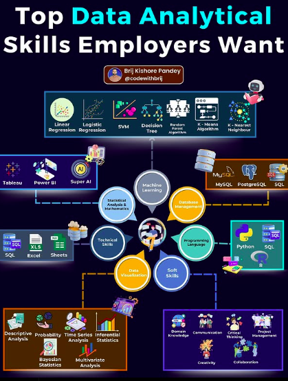

Here’s a **comprehensive breakdown of each data analytical skill**, explained with examples, tools, and step-by-step mastery paths. This detailed guide will help you understand the concepts, implement them practically, and master their applications.

---

### **1. Machine Learning**

#### **Core Concepts**:
- **Linear Regression**:
  - Predicts a continuous variable using a linear relationship.
  - **Example**: Predicting house prices based on square footage and location.

  ```python
  from sklearn.linear_model import LinearRegression
  model = LinearRegression()
  model.fit(X_train, y_train)  # X_train: features, y_train: target variable
  predictions = model.predict(X_test)
  ```

- **Logistic Regression**:
  - Predicts categorical outcomes.
  - **Example**: Determining if a customer will churn (`Yes`/`No`).

- **Decision Tree**:
  - A tree-based model for classification or regression.
  - **Example**: Classifying emails as spam or not.

- **K-Means Clustering**:
  - Groups data into clusters based on similarity.
  - **Example**: Grouping customers into segments based on purchase behavior.

#### **Tools**:
- **Python**: Scikit-learn, TensorFlow.
- **R**: Caret, mlr.

#### **Mastery Path**:
1. Learn **basics of supervised and unsupervised learning** using Scikit-learn.
2. Apply these models to real-world datasets like Titanic (classification) or Iris (clustering).
3. Experiment with hyperparameter tuning using tools like GridSearchCV.

---

### **2. Databases & Querying**

#### **Core Concepts**:
- **SQL**: The language to interact with relational databases.
- **NoSQL**: For unstructured or semi-structured data (e.g., MongoDB for document storage).

#### **Examples**:
- **SQL Query**: Fetch total sales by product category:
  ```sql
  SELECT category, SUM(sales) AS total_sales
  FROM sales_table
  GROUP BY category;
  ```

- **NoSQL Query**: Retrieve a document from MongoDB:
  ```python
  db.collection.find_one({"customer_id": 123})
  ```

#### **Applications**:
- Analyzing sales trends.
- Generating data for machine learning models.

#### **Tools**:
- **Relational Databases**: MySQL, PostgreSQL.
- **NoSQL Databases**: MongoDB, DynamoDB.

#### **Mastery Path**:
1. Start with basic SQL queries (SELECT, JOIN, GROUP BY).
2. Build a relational database schema for a sample project (e.g., an inventory management system).
3. Explore MongoDB for semi-structured data analysis.

---

### **3. Programming Languages**

#### **Python**:
- **Example**: Automating data cleaning with Pandas:
  ```python
  import pandas as pd
  df = pd.read_csv("data.csv")
  df.dropna(inplace=True)  # Remove missing values
  ```

#### **R**:
- **Example**: Statistical analysis:
  ```R
  t.test(group1, group2)
  ```

#### **Applications**:
- Writing machine learning algorithms.
- Automating repetitive tasks like data wrangling.

#### **Tools**:
- Python Libraries: Pandas, NumPy, Scikit-learn.
- R Libraries: ggplot2, dplyr.

#### **Mastery Path**:
1. Learn Python basics: data structures, loops, and conditionals.
2. Use Pandas for data manipulation and Matplotlib for visualization.
3. Explore R for statistical modeling.

---

### **4. Statistical Analysis**

#### **Core Concepts**:
- **Descriptive Statistics**: Summarizing data (mean, median, mode).
  - **Example**: Calculating the average sales for a region.

- **Inferential Statistics**: Drawing conclusions from samples.
  - **Example**: Testing whether a new ad campaign improves sales.

- **Bayesian Statistics**: Updating probabilities as more data becomes available.
  - **Example**: Calculating the likelihood of fraud based on transaction history.

#### **Tools**:
- Python: SciPy, Statsmodels.
- R: Base R, infer package.

#### **Mastery Path**:
1. Understand the difference between descriptive and inferential statistics.
2. Perform hypothesis testing on datasets (e.g., A/B testing results).
3. Explore Bayesian modeling with tools like PyMC3.

---

### **5. Data Visualization**

#### **Core Concepts**:
- **Data Dashboards**: Real-time visualization of KPIs.
  - **Example**: Tableau dashboard showing sales trends by region.

#### **Example**:
- **Python Visualization**:
  ```python
  import matplotlib.pyplot as plt
  plt.bar(categories, values)
  plt.show()
  ```

#### **Tools**:
- Tableau, Power BI, Matplotlib, Seaborn.

#### **Mastery Path**:
1. Start with static visualizations using Matplotlib.
2. Create interactive dashboards in Tableau or Power BI.
3. Experiment with advanced charts (heatmaps, treemaps).

---

### **6. Technical Skills**

#### **ETL Pipelines**:
- **Example**: Extract sales data from a database, transform it by cleaning, and load it into a warehouse.

  ```python
  # Example ETL process
  data = extract_data("database_connection")
  transformed_data = clean_data(data)
  load_to_warehouse(transformed_data)
  ```

#### **Excel**:
- Pivot tables, VLOOKUP for data aggregation.

#### **Google Sheets**:
- Collaborative data analysis.

#### **Mastery Path**:
1. Build an ETL pipeline using Python and PostgreSQL.
2. Practice advanced Excel functions for data analysis.
3. Use Sheets for lightweight collaboration.

---

### **7. Soft Skills**

#### **Key Skills**:
- **Communication**: Presenting findings in layman’s terms.
- **Critical Thinking**: Spotting patterns and anomalies.
- **Collaboration**: Working with cross-functional teams.

#### **Example**:
- Presenting insights from a sales analysis:
  - Highlight trends (e.g., "Sales increased by 15% after the new campaign").

#### **Mastery Path**:
1. Work on group projects or Kaggle competitions to enhance collaboration.
2. Practice presenting your findings with visuals and concise explanations.

---

### **Integrated Workflow Example**

#### **Scenario**: Analyzing customer churn for an e-commerce platform
1. **Data Extraction**:
   - Use SQL to retrieve customer interaction data.
2. **Data Cleaning**:
   - Use Pandas to handle missing values and filter relevant columns.
3. **Statistical Analysis**:
   - Perform hypothesis testing to identify factors affecting churn.
4. **Machine Learning**:
   - Train a logistic regression model to predict churn.
5. **Visualization**:
   - Use Tableau to create a dashboard showing churn rates by region.
6. **Communication**:
   - Present actionable insights to stakeholders (e.g., improve loyalty programs).

---

This in-depth approach ensures you master each skill while applying them to real-world problems. Let me know which topic you’d like to explore further!