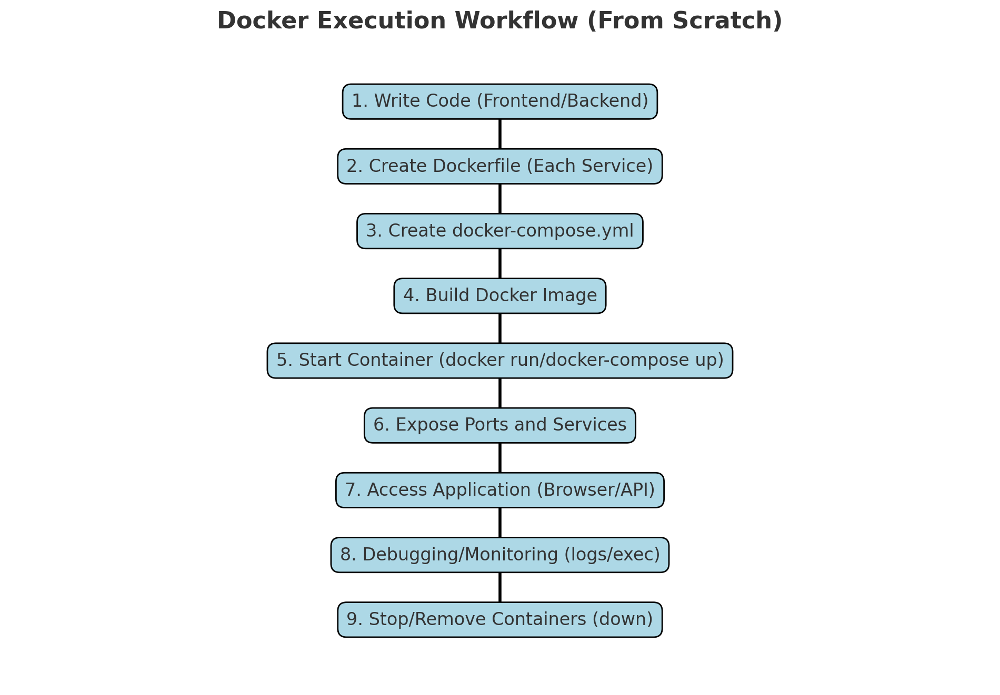

Here’s an improved version with a **clickable table of contents** and clearly structured headings. The goal is to make it easier to navigate the explanation and access relevant sections.

---

# **Docker Concepts and Real-World Example**

## **Table of Contents**
1. [Introduction to Docker Concepts](#introduction-to-docker-concepts)
   - [Docker Image](#docker-image)
   - [Docker Container](#docker-container)
   - [Dockerfile](#dockerfile)
   - [Build Process](#build-process)
   - [Docker Compose](#docker-compose)
2. [Docker Commands and Flags Explained](#docker-commands-and-flags-explained)
3. [Step-by-Step Real-World Example](#step-by-step-real-world-example)
   - [1. Create the Project Structure](#1-create-the-project-structure)
   - [2. Create the Index File](#2-create-the-index-file)
   - [3. Build the Frontend Application](#3-build-the-frontend-application)
   - [4. Build the Backend Application](#4-build-the-backend-application)
   - [5. Configure Docker Compose](#5-configure-docker-compose)
   - [6. Build and Run the Application](#6-build-and-run-the-application)
   - [7. Debugging and Monitoring](#7-debugging-and-monitoring)
4. [Summary and Practical Use Cases](#summary-and-practical-use-cases)

---

## **1. Introduction to Docker Concepts**

### **Docker Image**
- A pre-configured blueprint for a Docker container.
- **Example:** An image of Node.js that includes all the dependencies to run a JavaScript application.

### **Docker Container**
- A lightweight, isolated runtime environment created from a Docker image.
- **Example:** Running a Node.js server from the image.

### **Dockerfile**
- A text file with instructions to create a Docker image.
- Key sections include:
  - `FROM`: Specifies the base image.
  - `RUN`: Executes commands during the image build.
  - `EXPOSE`: Opens a port for the container.
  - `CMD`: Defines the command to run when the container starts.

### **Build Process**
- Converts a `Dockerfile` into an image using `docker build`.
- **Command Example:** `docker build -t my-app .`

### **Docker Compose**
- A tool to define and manage multi-container applications using a `docker-compose.yml` file.
- **Use Case:** Running a frontend, backend, and database together.

---

## **2. Docker Commands and Flags Explained**

| Command                     | Description                                                           |
|-----------------------------|-----------------------------------------------------------------------|
| `docker build -t app .`     | Builds a Docker image and tags it as `app`.                          |
| `docker run -d -p 3000:3000 app` | Runs the container in detached mode (`-d`) and maps ports.          |
| `docker-compose up`         | Starts services defined in the `docker-compose.yml` file.            |
| `docker-compose down`       | Stops and removes containers, networks, and volumes.                 |
| `docker logs <name>`        | Displays logs from a running container.                              |
| `docker exec -it <name> bash` | Opens an interactive shell inside a container for debugging.        |

---

## **3. Step-by-Step Real-World Example**

We’ll set up a **frontend**, **backend**, and **MySQL database**.

### **1. Create the Project Structure**

```bash
project/
├── frontend/
│   ├── Dockerfile
│   ├── package.json
│   └── src/
│       └── index.html
├── backend/
│   ├── Dockerfile
│   ├── package.json
│   └── server.js
├── docker-compose.yml
└── index.html
```

---

### **2. Create the Index File**

This file provides clickable links to access the services.

#### **Contents of `index.html`:**
```html
<!DOCTYPE html>
<html lang="en">
<head>
  <meta charset="UTF-8">
  <meta name="viewport" content="width=device-width, initial-scale=1.0">
  <title>App Services</title>
</head>
<body>
  <h1>Welcome to the Application</h1>
  <ul>
    <li><a href="http://localhost:3000" target="_blank">Frontend (React)</a></li>
    <li><a href="http://localhost:5000" target="_blank">Backend API (Node.js)</a></li>
  </ul>
</body>
</html>
```

---

### **3. Build the Frontend Application**

Navigate to the `frontend/` folder and create the following:

#### **Frontend Dockerfile:**
```dockerfile
FROM node:16
WORKDIR /app
COPY package.json .
RUN npm install
COPY . .
EXPOSE 3000
CMD ["npm", "start"]
```

#### **Contents of `frontend/package.json`:**
```json
{
  "name": "frontend",
  "version": "1.0.0",
  "scripts": {
    "start": "react-scripts start"
  },
  "dependencies": {
    "react": "^18.0.0",
    "react-dom": "^18.0.0",
    "react-scripts": "5.0.1"
  }
}
```

---

### **4. Build the Backend Application**

Navigate to the `backend/` folder and create the following:

#### **Backend Dockerfile:**
```dockerfile
FROM node:16
WORKDIR /app
COPY package.json .
RUN npm install
COPY . .
EXPOSE 5000
CMD ["node", "server.js"]
```

#### **Contents of `backend/package.json`:**
```json
{
  "name": "backend",
  "version": "1.0.0",
  "scripts": {
    "start": "node server.js"
  },
  "dependencies": {
    "express": "^4.18.0"
  }
}
```

---

### **5. Configure Docker Compose**

The `docker-compose.yml` file orchestrates all services.

#### **Contents of `docker-compose.yml`:**
```yaml
version: "3.9"
services:
  frontend:
    build:
      context: ./frontend
    ports:
      - "3000:3000"
    depends_on:
      - backend

  backend:
    build:
      context: ./backend
    ports:
      - "5000:5000"
    depends_on:
      - db

  db:
    image: mysql:5.7
    environment:
      MYSQL_ROOT_PASSWORD: rootpassword
      MYSQL_DATABASE: mydb
    ports:
      - "3306:3306"
```

---

### **6. Build and Run the Application**

#### **Build the Images:**
```bash
docker-compose build
```

#### **Start All Services:**
```bash
docker-compose up -d
```

#### **Verify Running Containers:**
```bash
docker ps
```

---

### **7. Debugging and Monitoring**

#### **View Logs for a Service:**
```bash
docker logs <container-name>
```

#### **Access the Container’s Shell:**
```bash
docker exec -it <container-name> bash
```

#### **Stop and Remove All Services:**
```bash
docker-compose down
```

---

## **4. Summary and Practical Use Cases**

1. **Development:** Isolate dependencies and ensure consistency across environments.
2. **Testing:** Use Docker to spin up isolated test environments.
3. **Deployment:** Orchestrate multi-container applications using Docker Compose.



**Additional Notes**
Not exactly! The `.` in the `docker build` command does **two things**:

1. **Specifies the build context**:  
   It tells Docker where to find all the files it might need during the build process. These include:
   - The `Dockerfile`.
   - Any files that the `Dockerfile` references (e.g., files you `COPY` into the image).

   Example:  
   If your project structure is:
   ```
   project/
   ├── Dockerfile
   ├── app/
   │   └── index.js
   └── package.json
   ```
   Running `docker build -t my-app .` sends the entire `project/` directory as the build context.

2. **Locates the Dockerfile (implicitly)**:  
   Docker searches for a file named `Dockerfile` in the specified context directory. If it finds the `Dockerfile` there, it uses it to build the image.

   - If the `Dockerfile` isn't in the current directory, you can specify its location explicitly with the `-f` flag:
     ```bash
     docker build -t my-app -f /path/to/Dockerfile /path/to/context
     ```

---

### **Key Takeaways**
- **`.` refers to the current directory**, and it serves as the **build context**.
- The `Dockerfile` is typically in the build context directory.
- Docker sends everything in the build context to the Docker daemon during the build, so keep the context clean using `.dockerignore`.

---

### **Example Scenarios**

#### **Scenario 1: Dockerfile in Current Directory**
```bash
docker build -t my-app .
```
- The `Dockerfile` is in the current directory.
- The entire current directory is the build context.

---

#### **Scenario 2: Dockerfile in a Subdirectory**
```bash
docker build -t my-app -f ./docker/Dockerfile .
```
- The `Dockerfile` is in `./docker/`.
- The current directory (`.`) is the build context.

---

#### **Scenario 3: Separate Build Context and Dockerfile**
```bash
docker build -t my-app -f ./docker/Dockerfile ./context/
```
- The `Dockerfile` is in `./docker/`.
- The build context is `./context/`.

In this case, Docker will only send files from `./context/` to the Docker daemon. It won't include files from `./docker/`.

---

The `.` is **not just for locating the Dockerfile**—it's for defining the build context, which is crucial for the image-building process. Let me know if you'd like more clarification!