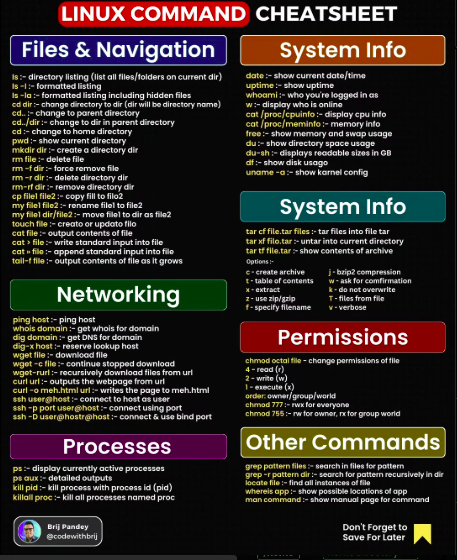

Here’s a comprehensive explanation of the **18 Most Used Linux Commands**, focusing on their **real-world applications** and how they are commonly used in practice. I’ll also suggest related commands/tools where applicable to enhance your understanding.

---

### **1. `ls` - List Directory Contents**
- **Real-World Use**:
  - Check the contents of a directory.
  - Use `ls -l` for detailed information like file size, permissions, and ownership.
  - Use `ls -a` to see hidden files (files starting with `.`).
- **Example**:
  ```bash
  ls -l /var/log
  ```
  View all logs in the `/var/log` directory with detailed info.

---

### **2. `cd` - Change Directory**
- **Real-World Use**:
  - Navigate between directories in a file system.
  - Combine with `..` to move up one level (`cd ..`).
- **Example**:
  ```bash
  cd /etc
  ```
  Navigate to the `/etc` directory to edit configuration files.

---

### **3. `mkdir` - Make a New Directory**
- **Real-World Use**:
  - Create directories for organizing files.
  - Use `mkdir -p` to create parent directories if they don’t exist.
- **Example**:
  ```bash
  mkdir -p /data/projects
  ```
  Creates `/data` and `projects` if they don’t exist.

---

### **4. `rm` - Remove Files or Directories**
- **Real-World Use**:
  - Delete unnecessary files or directories.
  - Use `rm -r` to delete directories recursively and `rm -i` to confirm before deletion.
- **Example**:
  ```bash
  rm -rf /tmp/*
  ```
  Clears all files in the `/tmp` directory.

---

### **5. `mv` - Move or Rename Files or Directories**
- **Real-World Use**:
  - Move files between directories or rename them.
- **Example**:
  ```bash
  mv file1.txt /backup/
  mv file1.txt file2.txt
  ```
  Moves `file1.txt` to the `/backup/` directory or renames it to `file2.txt`.

---

### **6. `chmod` - Change File/Directory Permissions**
- **Real-World Use**:
  - Adjust permissions for files to control access.
  - Use `chmod +x` to make a file executable or `chmod 755` to set specific permissions.
- **Example**:
  ```bash
  chmod +x script.sh
  chmod 644 file.txt
  ```
  Makes `script.sh` executable or sets read-write for the owner and read-only for others.

---

### **7. `cp` - Copy Files or Directories**
- **Real-World Use**:
  - Duplicate files or create backups.
  - Use `cp -r` to copy directories.
- **Example**:
  ```bash
  cp file1.txt /backup/
  cp -r /data /backup
  ```
  Copies `file1.txt` to `/backup/` or copies the entire `/data` directory.

---

### **8. `chown` - Change Ownership**
- **Real-World Use**:
  - Change file ownership, especially for shared systems or after transferring files.
- **Example**:
  ```bash
  chown user1 file.txt
  chown -R user1:group1 /project
  ```
  Changes ownership of `file.txt` to `user1` or recursively assigns ownership of `/project`.

---

### **9. `grep` - Search for Patterns in Files**
- **Real-World Use**:
  - Locate specific strings in logs or code files.
  - Use `grep -i` for case-insensitive search and `grep -r` to search recursively.
- **Example**:
  ```bash
  grep "error" /var/log/syslog
  ```
  Searches for "error" in the system log file.

---

### **10. `top` - Display System Processes**
- **Real-World Use**:
  - Monitor real-time CPU and memory usage.
  - Identify processes consuming resources.
- **Example**:
  ```bash
  top
  ```
  Displays running processes in real-time.

---

### **11. `cat` - Concatenate and Display Files**
- **Real-World Use**:
  - View the contents of a file or combine multiple files.
- **Example**:
  ```bash
  cat file1.txt
  cat file1.txt file2.txt > combined.txt
  ```
  Displays `file1.txt` or combines two files into `combined.txt`.

---

### **12. `tar` - Create or Extract Archive Files**
- **Real-World Use**:
  - Compress or extract tar archives for backups or file transfers.
  - Combine with gzip (`tar -czf`) for compression.
- **Example**:
  ```bash
  tar -czf backup.tar.gz /data
  tar -xzf backup.tar.gz
  ```
  Compresses the `/data` directory or extracts `backup.tar.gz`.

---

### **13. `ps` - Display Running Processes**
- **Real-World Use**:
  - View detailed information about running processes.
  - Use `ps aux` to see all processes with CPU/memory stats.
- **Example**:
  ```bash
  ps aux | grep apache
  ```
  Lists all Apache processes.

---

### **14. `kill` - Terminate Processes**
- **Real-World Use**:
  - End unresponsive or unwanted processes.
  - Use `kill -9` for a forceful termination.
- **Example**:
  ```bash
  kill 1234
  kill -9 1234
  ```
  Terminates the process with PID `1234`.

---

### **15. `pwd` - Print Working Directory**
- **Real-World Use**:
  - Determine the current directory path, especially in nested structures.
- **Example**:
  ```bash
  pwd
  ```
  Outputs the full path of the current directory.

---

### **16. `sudo` - Execute Commands as Superuser**
- **Real-World Use**:
  - Perform administrative tasks like installing software or modifying system files.
- **Example**:
  ```bash
  sudo apt update
  sudo rm -rf /restricted
  ```
  Updates the package list or deletes a restricted directory.

---

### **17. `ping` - Test Network Connectivity**
- **Real-World Use**:
  - Check if a server or host is reachable and measure latency.
- **Example**:
  ```bash
  ping google.com
  ```
  Tests connectivity to Google and reports latency.

---

### **18. `du` - Estimate File Space Usage**
- **Real-World Use**:
  - Identify which files or directories consume the most disk space.
  - Use `du -h` for human-readable sizes.
- **Example**:
  ```bash
  du -sh /var/log
  ```
  Shows the size of the `/var/log` directory.

---

### **Suggestions for Enhanced Productivity**
1. **Combine Commands**:
   - Use pipes (`|`) and redirection (`>`, `>>`) to combine commands. For example:
     ```bash
     ps aux | grep apache > apache_processes.txt
     ```
     Saves Apache processes to a file.

2. **Use Aliases**:
   - Simplify frequent commands:
     ```bash
     alias ll="ls -alh"
     ```

3. **Learn Shell Scripting**:
   - Combine these commands in scripts to automate tasks like backups, monitoring, or file management.

4. **Install Additional Tools**:
   - **htop**: Interactive alternative to `top`.
   - **ncdu**: Visual alternative to `du`.
   - **rsync**: Advanced file copying with syncing capabilities.

---

By mastering these commands and applying them effectively, you can handle almost any Linux task efficiently! Let me know if you’d like more examples or deeper insights into any command!